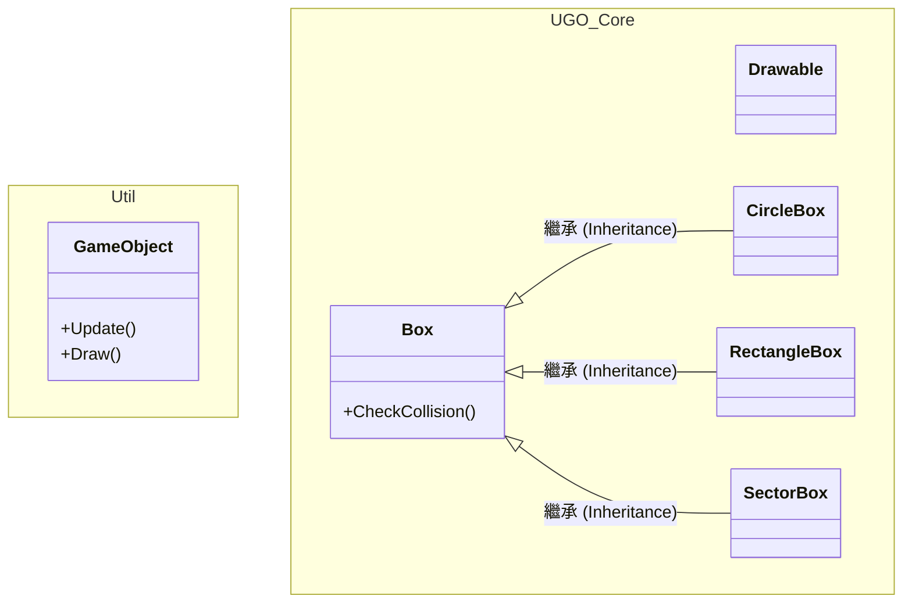
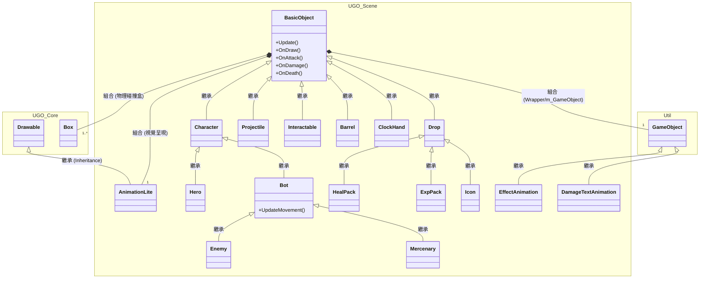
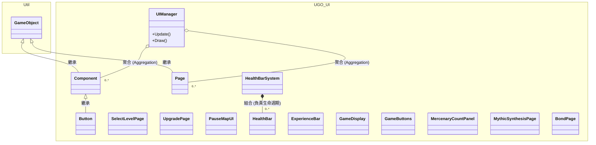
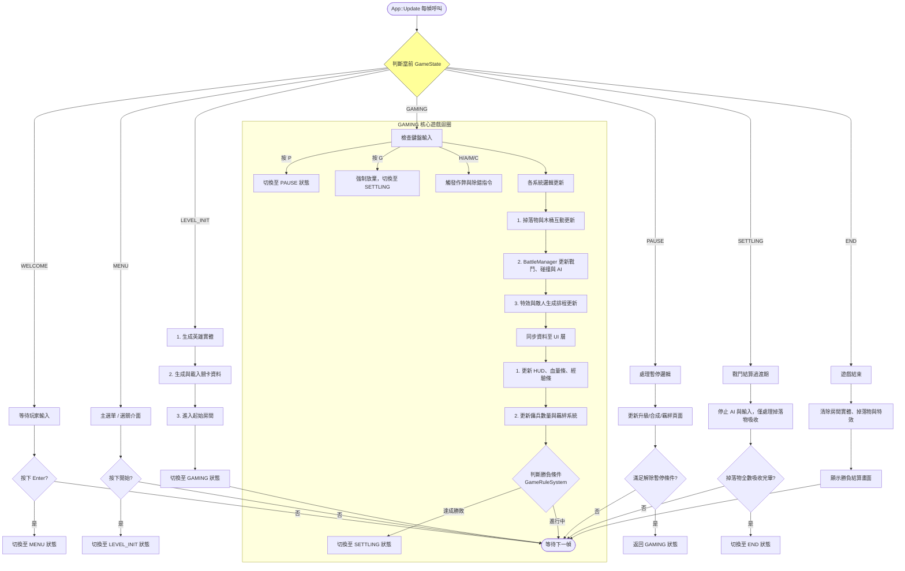

# 2026 OOPL Final Report

## 組別資訊

組別：第40組
組員：
- 113820024 蘇珊
- 113820027 劉育維

復刻遊戲：UnderGuild: Offence

## 專案簡介
### 遊戲簡介
《UnderGuild: Offense》是一款融合了快節奏動作、Roguelike 隨機探索與戰術防禦的 2D 俯視角動作遊戲。玩家將扮演一名實力強大的「守護者英雄」，深入危機四伏的地下城與下水道，利用流暢的走位、武器攻擊與傭兵召喚，迎戰一波波如潮水般湧入的敵方怪物。在隨機生成的關卡中，每一次決策、走位與部署都將左右戰局。

### 組別分工

## 遊戲介紹
### 遊戲規則
1. **探索與戰鬥**：玩家進入每個房間後，需擊敗所有生成的敵人才能前進。
2. **升級系統**：擊殺敵人或完成特定條件可獲得資源，用於召喚傭兵夥伴，或是升級玩家自身能力（如血量、攻擊力、冷卻時間等）。
3. **場景互動**：房間內會有可互動或可破壞的物件（如木桶），可能掉落額外資源。
4. **結束條件**：玩家生命值歸零或敵人數量超過上限，則遊戲結束（進入結算畫面），或者通關所有預設關卡。
### 遊戲畫面
歡迎頁

主畫面

菜單頁

抽卡畫面

合成表

戰鬥畫面

羈絆效果

## 程式設計

### 程式架構
類別繼承圖
### 1. 核心框架與物理引擎 (Core Framework & Physics)

### 2. 遊戲實體繼承與組合 (Scene Entities)

### 3. 使用者介面管理 (UI Management)

### 4. 遊戲系統與應用程式根節點 (Logic Systems & App)

```mermaid
classDiagram
    namespace UGO_Scene {
        class Hero
        class Enemy
        class Mercenary
    }

    namespace UGO_UI {
        class UIManager
        class SelectLevelPage
        class UpgradePage
        class PauseMapUI
        class MythicSynthesisPage
        class BondPage
        class HealthBarSystem
        class ExperienceBar
    }

    %% Logic Systems (Single Responsibility & Decoupled)
    namespace UGO_System {
        class BattleManager {
            +Update()
            +AIUpdate()
            +DetectCollisions()
        }
        class LevelSystem
        class GameRuleSystem
        class UpgradeManager
        class SteeringSystem
        class RewardManager
        class MapSystem
        class EnemiesSpawnerSystem
        class EffectAnimationManager
        class ExpSystem
        class DropSystem
        class MercenaryConditionSystem
        class BarrelSystem
        class CharacterFactory
    }
    
    BattleManager *-- "0..1" Hero : 組合 (生命週期由 System 管理)
    BattleManager o-- "0..*" Enemy : 聚合 (採用物件池 Object Pool)
    BattleManager o-- "0..*" Mercenary : 聚合 (採用物件池 Object Pool)
    
    %% Central Application Root
    namespace UGO {
        class App {
            +Start()
            +Update()
            +End()
        }
    }
    
    %% App 作為最上層的 Controller，管理所有子系統與大層級 UI 的生命週期
    App *-- "1" UIManager : 組合 (Composition)
    App *-- "1" BattleManager : 組合
    App *-- "1" LevelSystem : 組合
    App *-- "1" GameRuleSystem : 組合
    App *-- "1" UpgradeManager : 組合
    App *-- "1" RewardManager : 組合
    App *-- "1" SteeringSystem : 組合
    App *-- "1" MapSystem : 組合
    App *-- "1" MercenaryConditionSystem : 組合
    App *-- "1" BarrelSystem : 組合
    App *-- "1" CharacterFactory : 組合
    
    App *-- "1" SelectLevelPage : 組合
    App *-- "1" UpgradePage : 組合
    App *-- "1" PauseMapUI : 組合
    App *-- "1" MythicSynthesisPage : 組合
    App *-- "1" BondPage : 組合
    App *-- "1" HealthBarSystem : 組合
    App *-- "1" ExperienceBar : 組合
```

遊戲主流乘控制
### App::Update 核心程式邏輯流程圖

### 程式技術
#### 1. 物件導向三大特性與多型 (OOP & Polymorphism)
- **實踐範例**：`BasicObject` $\rightarrow$ `Character` $\rightarrow$ `Bot` $\rightarrow$ `Enemy` 的繼承樹。
- **說明**：利用繼承來重用核心屬性（如血量、速度），並透過 `virtual` 虛擬函式（如 `OnAttack()`, `OnDamage()`, `Update()`）實作多型。不同種類的實體在 `BattleManager` 中可以使用統一的基底指標 `Character*` 進行批次處理與多型呼叫。
#### 2. 物件池模式 (Object Pool Pattern)
- **實踐範例**：`BattleManager` 中的 `m_EnemyPool` 與 `m_MercenaryPool`。
- **說明**：專案中實作了帶有自訂刪除器 (`Custom Deleter`) 的 `PooledCharacter` 智慧指標。這確保了敵人與傭兵在死亡時不會被徹底解構釋放記憶體，而是標記為不可見並回收至記憶體池中，大幅減少了執行期間動態配置記憶體 (`new`/`delete`) 所帶來的效能開銷與延遲。
#### 4. 享元模式 / 快取池 (Flyweight Pattern & Caching)
- **實踐範例**：`DamageTextAnimation` (傷害數字特效)。
- **說明**：傷害數字系統使用了一個靜態的 `std::unordered_map` 作為快取池，並且將數字數值與顏色類型打包壓縮成一個 `uint64_t` 的位元鍵值 (bit-packed key)。這避免了在戰鬥中大量跳出傷害數字時，頻繁配置字串與 UI 貼圖物件造成的卡頓與記憶體碎片。
#### 5. 工廠模式 (Factory Pattern)
- **實踐範例**：`CharacterFactory` 系統。
- **說明**：將所有實體的創建邏輯（包含載入圖片、設定基礎屬性、綁定碰撞盒）集中封裝於工廠類別中。其他系統只要呼叫 `CreateEnemy` 等方法並傳入參數，即可獲得完整的物件實體，統一了物件的生成路徑並降低類別間的依賴。
#### 6. 狀態機模式 (State Machine)
- **實踐範例**：主程式 `App` 的 `m_CurrentGameState` 與 `LevelSystem::RoomState`。
- **說明**：遊戲主迴圈透過明確的 `GameState`（如 WELCOME, MENU, GAMING, PAUSE, SETTLING, END）來嚴格控制每個階段該做什麼事。例如在 `SETTLING` 狀態下，會暫停玩家輸入與 AI 運算，專心處理掉落物的吸收動畫。這不僅提高了程式碼審查時的閱讀性，也在後期插入、變更段落邏輯時讓開發更有效率。
#### 7. 資料驅動設計 (Data-Driven Design)
- **實踐範例**：`LevelData.json` 與 `MapSystem`。
- **說明**：關卡的難度曲線、房間種類配置與敵人波次，全部從外部的 JSON 檔案動態讀取。這代表不需重新編譯 C++ 程式碼就能調整遊戲節奏與關卡生成規則。
#### 8. 單一職責與依賴注入 (Single Responsibility & Dependency Injection)
- **實踐範例**：所有的 `System` 類別 (如 `GameRuleSystem`, `SteeringSystem` 等)。
- **說明**：各系統被拆分為極細的單一職責（例如專門判斷勝負的 `GameRuleSystem`，專門控制排斥移動的 `SteeringSystem`）。這些系統在 `App` 啟動時被創建，並透過**建構子注入 (Constructor Injection)** 將互相需要的系統參考 (`Reference`) 傳遞進去，取代了難以追蹤的全域變數 (Global Variables)。
#### 9. 資源共享與輕量化封裝 (Resource Sharing / Advanced Flyweight)
- **實踐範例**：`AnimationLite` 類別 (`SharedFrames`)。
- **說明**：專案自定義了 `AnimationLite` 取代底層的厚重動畫類別。它將「動畫的播放狀態」(目前的 frame index、計時器) 與「實際的紋理資料」( `std::vector<std::shared_ptr<Util::Image>>` ) 分離。透過 `shared_ptr` 共享 `FrameList`，畫面上即使有 100 隻相同的怪物，記憶體中也只會載入一份圖片資源，達成極致的記憶體、GPU、CPU節約。
#### 11. 時間抽象化與暫停機制 (Time Abstraction)
- **實踐範例**：`Core::Time::AdvanceTick` 與各種 `CountDownTimer`。
- **說明**：捨棄了直接在每個 `Update` 內抓取系統 `DeltaTime` 的粗暴作法，專案實作了全局的 `Tick` 管理。當遊戲進入 `PAUSE` 狀態時，`App` 只需要停止呼叫 `AdvanceTick()`，畫面上所有依賴此時間軸的動畫、技能冷卻與 AI 就會自然凍結，無需在每一個物件內都寫入 `if (!paused)` 的冗餘判斷。
#### 12. 群體轉向行為 (Steering Behavior - Separation)
- **實踐位置**：`SteeringSystem::GetRepelMovement`。
- **說明**：為了避免多個敵人或傭兵在追蹤主角時「重疊」成一個點，專案實作了 Craig Reynolds 經典 Boids 演算法中的「分離 (Separation)」行為。透過動態計算實體間的斥力向量，讓戰場上的單位能夠自然地散開包圍目標，提升戰鬥視覺的真實感。

### 使用到 AI/AI Agent 的部分 (沒有用到者，不需要寫這篇)
為了確保專案品質與架構純潔性，我們採用了嚴謹的分階段 AI 協作策略：

#### 1. 分階段協作策略
- **前期 (系統基底建構)**：採用純手動撰寫，拒絕「Vibe-Coding（盲目依賴 AI 產出代碼）」帶來的隱患，以確保基礎 OOP 架構穩健且符合專案未來的擴充需求。此階段僅將 AI 視為進階知識庫，協助尋找底層工具或重現遊戲原作演算法邏輯，大幅降低查閱文獻的時間成本。
- **中期 (功能過渡階段)**：逐漸導入 AI 輔助實作，但嚴格限制其作用範圍。僅將 AI 用於繁瑣的程式碼遷移與基礎樣板操作，而不允許直接採用 AI 擅自設計的架構。
- **後期 (擴充與 Agent 協作)**：在整體架構已十分完善，且確立了絕對的維護性與擴充性後，大量引入 AI Agent 協作。如 **UI 介面組件**與 **JSON 關卡測試參數機制**，幾乎完全交由 AI Agent 進行設計與實作，開發團隊僅負責微調與給出修改方向。

#### 2. 核心應用實例
- **嚴謹的審查與規範約束**：專案核心邏輯與架構仍完全由組員討論規劃。對於 AI 產出的程式碼，逐行審查有無優化空間，並強制 AI Agent 必須遵守特定開發規範（如 PCH 統一引入、最小修改原則等）。
- **系統重構與效能優化**：AI 協助將「傷害數字特效」快取系統優化為 `uint64_t` bit-packed key，並實作了無記憶體洩漏的 Flyweight (享元) 模式，解決了戰鬥後期的效能瓶頸。
- **複雜 Bug 追蹤與修復**：透過提供系統日誌與原始碼上下文，AI 協助排查了 `LevelSystem` 的 JSON 讀取解析錯誤、UI (`HealthBar`) 渲染層級的覆蓋問題，以及狀態機 (`GameState`) 切換時因未清空指標而發生的崩潰。

## 結語

### 問題與解決方法
#### 一、Git 版本控制與協作
1. **初期操作不熟練**：
   - **情境**：開發前期經常錯誤執行 `commit` 與 `push`，後續嘗試使用 `--hard` 或 `--force` 進行補救時，反而導致分支狀態更加混亂。
   - **解法**：在面臨無法復原的版本衝突時，主動尋求 AI 協助梳理歷史紀錄與重置分支，並從錯誤中學習正確的 Git 操作觀念。
2. **避免合併衝突 (Merge Conflicts)**：
   - **情境**：前、中期各自使用分支開發時，常因同時修改到相同模組的程式碼，導致嚴重的合併衝突。
   - **解法**：中期開始建立團隊規範，每次完成 `merge` 後必定先開會討論接下來的實作分工。在需要修改底層架構前，會先與對方確認。自此大幅減少了複雜的程式碼衝突，省下可觀的合併時間。
3. **分支管理與追蹤**：
   - **情境**：中期前常遇到多個分支交錯纏繞，導致追蹤功能進度與合併的難度急遽上升。
   - **解法**：後續採用「以大功能為單位」的分支策略，在核心功能開發完成後直接從該 `commit` 切出新分支，並善用 `cherry-pick` 靈活轉移必要的程式碼。
   - **補充**：雖然到了開發後期，隨著團隊溝通頻率增加與對各分支用途的熟悉，不再過度拘泥於 Git 樹狀圖的絕對整潔，但也因建立了良好的默契，幾乎不再發生分支互相糾纏的問題。

#### 二、基礎架構規劃
1. **雙座標系統設計 (Coordinate System)**：
   - **情境**：初期在定義遊戲座標系統時，討論了多種方案，但各有其在實作上的優缺點（如渲染對齊與邏輯判斷的衝突）。
   - **解法**：最終決定實作 Grid (網格) 與 World (世界) 雙座標系統，並分別定義 `upper-left-base` (左上角為基準) 以及 `central-base` (中心點為基準)。透過封裝完善的轉換函式，讓開發後期在計算距離或實體位置時，無須再分心處理底層的座標轉換邏輯。
2. **類別繼承與擴充規劃**：
   - **情境**：專案從零開始時，對整體的架構規劃尚無明確頭緒，類別設計經歷了多次的推翻與重建。
   - **解法**：改採「需求導向」搭配「逐步抽象」的策略：先實作基本功能，再從不同實體中萃取出相同的邏輯進行抽象化。最終收斂出了穩健的 `BasicObject` $\rightarrow$ `Character` $\rightarrow$ `Bot` 繼承鏈路，後期的所有遊戲實體皆順利圍繞此架構進行擴充。
3. **客製化尋路與推擠演算法**：
   - **情境**：雖然業界有許多成熟的尋路演算法，但為了最大限度還原原作的移動手感，團隊在測試多種演算法後仍未找到完美相符的現成方案。
   - **解法**：透過詳細分析遊戲內角色的移動行為並與 AI 反覆討論，團隊選擇不盲目套用傳統演算法，而是針對專案需求，經過無數次的參數微調，自主設計了目前的移動與群體分離 (Separation) 演算法。
   - **補充**：學期中曾發現遊戲原作更新並改良了移動邏輯。團隊經討論後，考量到專案時程與穩定性，決定維持當前已開發完善的版本，不盲目追求原作的無止盡更新。
#### 三、效能問題與記憶體管理
1. **底層動畫渲染之效能瓶頸 (Animation Overhead)**：
   - **情境**：原先使用的引擎底層類別 `Util::Animation` 未將播放狀態與紋理資源解耦。這導致即使開發時嘗試使用 `shared_ptr`，每生成一個新物件仍必須創建獨立的動畫實體並重複載入圖片，造成記憶體呈現 $O(n)$ 級別的不必要浪費。
   - **解法**：團隊獨立設計了 `UGO::Scene::AnimationLite`，不僅向下相容既有的渲染介面，更成功將「播放狀態」與「圖片資源」徹底分離。實作後，所有同類物件皆能共享唯一的記憶體資源，將記憶體開銷降至 $O(1)$，使硬體效能佔用率大幅降至原先的 1% 以下。
2. **大量實體頻繁創建之開銷 (Entity Instantiation)**：
   - **情境**：本遊戲核心玩法包含大量敵人的生成與消滅。若頻繁呼叫 `new` 與 `delete` 動態配置記憶體，將對 CPU 造成運算負擔，並嚴重加劇記憶體碎片化。
   - **解法**：為了最大化回收與共用資源，團隊決定實作**物件池模式 (Object Pool)**。透過自定義 `std::unique_ptr` 的解構函式 (Custom Deleter)，讓角色實體在生命值歸零時不會被徹底銷毀，而是標記隱藏並自動回歸至 `pool` 中等待重新啟用，將戰鬥期間的實體創建複雜度極致壓縮至 $O(1)$。
3. **記憶體異常增長與洩漏排查 (Memory Growth & Leaks)**：
   - **情境**：在開發中後期，測試發現遊戲執行時間一長，記憶體佔用竟暴增至超過 13GB，引發了對嚴重 Memory Leak (記憶體洩漏) 的疑慮。
   - **解法**：團隊運用日誌與縮小範圍法進行逐步排查，最終發現是因為大量的 `DamageText` (傷害數字) 與廢棄的動畫物件被持續加入底層的渲染樹中，卻從未被正確移除並釋放所致。在修復此問題的過程中，我們也順勢導入了**享元模式 (Flyweight Pattern)** 作為傷害數字的快取解法，與 `AnimationLite` 的設計相輔相成，徹底根除了專案的效能缺陷。

### 自評

| 項次 | 項目                   | 完成 |
|------|------------------------|-------|
| 1    | 這是範例 |  V  |
| 2    | 完成專案權限改為 public |    |
| 3    | 具有 debug mode 的功能  |    |
| 4    | 解決專案上所有 Memory Leak 的問題  |    |
| 5    | 報告中沒有任何錯字，以及沒有任何一項遺漏  |    |
| 6    | 報告至少保持基本的美感，人類可讀  |    |

### 心得

113820024 蘇珊:
在這次遊戲專題開發過程中，我主要負責 UI 介面的設計與實作，以及遊戲中傭兵合成系統的大部分邏輯開發。透過這次專案，我不僅實際運用了課堂上學到的物件導向設計概念，也更加了解大型程式專案中各系統之間如何協同運作。

在 UI 開發方面，我負責設計與實作遊戲中的各種介面元件，包含資訊顯示、按鈕互動以及不同遊戲狀態下的畫面切換。由於專案採用了狀態機模式管理遊戲流程，因此在主選單、遊戲進行、暫停與結算等不同階段，都能透過明確的狀態切換控制介面的顯示內容，讓整體架構更加清晰，也方便後續功能擴充與維護。此外，在實作血條、角色資訊以及其他 HUD 元件時，也需要與角色系統進行整合，讓畫面能即時反映遊戲內部資料的變化。

除了 UI 之外，我也負責了大部分的傭兵合成邏輯。由於遊戲中存在多種不同類型的傭兵與升級路線，因此必須設計完整的判斷流程來處理合成條件、角色替換以及數值繼承等問題。在開發過程中，我需要不斷測試各種可能情況，確保玩家在不同階段進行合成時都能獲得正確結果。這部分讓我更加理解資料結構規劃的重要性，也學習到如何將複雜的遊戲規則整理成容易維護的程式邏輯。

在這次專案中，我也對物件導向程式設計有了更深入的理解。過去對於繼承、多型等概念大多停留在課堂練習，但實際參與開發後，才真正體會到這些設計在大型專案中的價值。例如透過 Character、Bot 與 Enemy 等類別的繼承架構，可以有效整理不同角色之間共通與獨特的功能，而多型則讓系統能用一致的方式管理各種角色行為。除此之外，我也了解到工廠模式如何將物件建立流程集中管理，減少程式之間的耦合性，使後續新增角色時更加方便。另一個讓我印象深刻的是資料驅動設計，透過 JSON 檔案就能調整關卡內容與敵人配置，讓我認識到資料與程式邏輯分離所帶來的彈性與便利性。

在團隊合作方面，我們使用 Git 進行版本控制。雖然初期曾遇到分支管理與合併衝突等問題，但透過制定開發規範與定期討論分工後，協作流程逐漸穩定。另一方面，我們也適度利用 AI 作為輔助工具，協助查詢資料、排查問題以及開發部分 UI 元件，提高整體開發效率。

透過這次專題，我學習到遊戲開發不只是單純撰寫程式，更包含架構規劃、效能考量與團隊溝通等能力。尤其在 UI 與傭兵合成系統的開發過程中，讓我累積了許多實務經驗，也對未來的軟體開發與遊戲設計有更深入的理解。

113820027 劉育維:
我真的很喜歡這門課程，並且在其中也學到非常大量的實作經驗，其中最重要的應該非 Git 莫屬了。之前只有處理小型專案時，Git 都隨便用，有就好，甚至只有一條分支樹，完全把它當作自動存檔的工具。然而在這學期的~~痛苦~~實作中，才瞭解到 Git 的真正用法，以及在不同情況下會產生的問題，當然還有遇到合併衝突時該如何解決。
這次的專案，我自認基底架構算是非常完美的，雖然 OOP 並不是現今最好的架構方式，然而它給的是一種觀念，不管在哪個架構之下，這些架構觀都是相當重要的一部分。我認為 OOP 最厲害的部分就在於它的繼承以及多型轉換想法，可以大量降低重複程式碼的情形，從而提高未來 DEBUG 或是維護時的效率。在這次的專案之中，我並沒有完全死板依照 OOP 架構，而是在其之上採用了部分的 ECS 架構（雖然說實在的，就只是類似 config files 的概念而已，畢竟本身與 OOP 還是有點像是光譜的兩端）。
除此之外，我覺得還有一點是非常重要的，就是團隊合作能力，尤其是排版的部分。雖然說可以嚴格規定排版規則，但還是難免在某些情況之下會有些衝突。曾經就因為看不慣排版，強行修改，結果就是大量 conflicts ~~當然我沒有承認是我的問題XD~~。經歷過幾次的慘痛教訓，也就真正體會到只要能正常運作，就不要隨便修改。真的有需要時，再留到重構處理就好。
當然學到的內容遠遠不只這些，但如果要全部列出來，我認為即使萬字也說不清。總而言之，我認為這次的實作是非常難得的一次經驗，就如真的在模擬未來進入業界實操時，會遇到的各種情境，所以是個非常寶貴的練習機會。

### 貢獻比例
113820027 劉育維 50%
113820024 蘇珊 50%