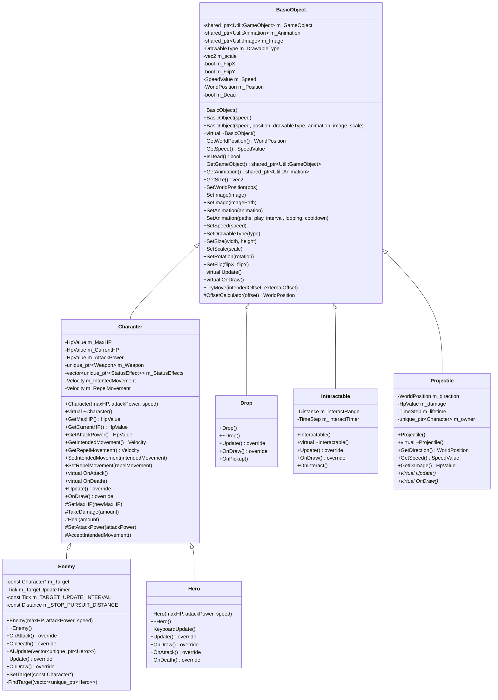
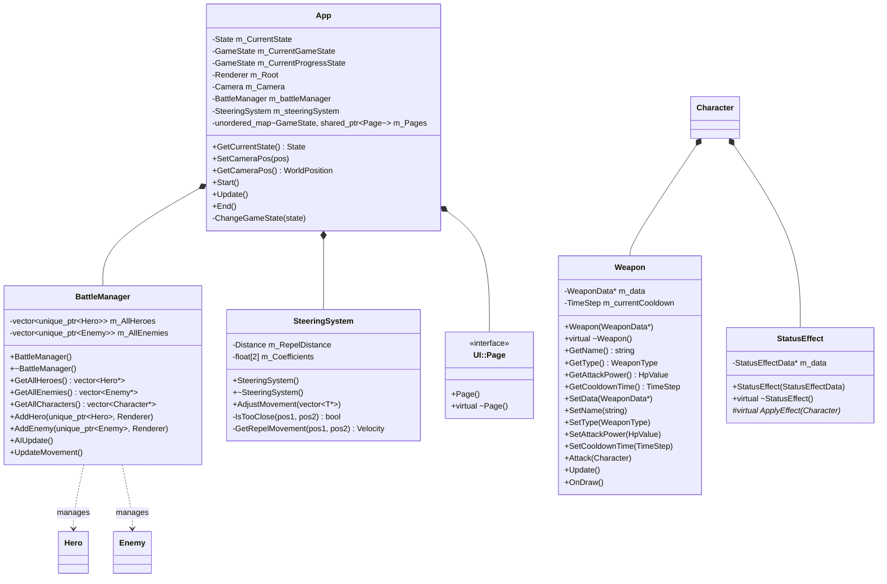
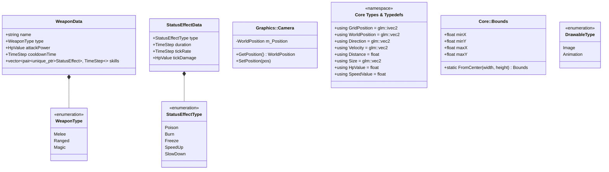

# UGO 遊戲專案架構 (PTSD-Template)

本文件整理了專案中位於 `src/Scene` 及其系統 (`System`, `Core`) 之類別設計與架構。此架構圖表遵照完整的 Mermaid UML 語法，包含所有類別的存取層級（`+`, `-`, `#`）、方法參數及屬性。

## 1. 完整類別圖（繼承、屬性、方法）

此圖表整理了以 `BasicObject` 為根的遊戲場景物件（Entity）繼承體系，以及各個實體的完整類別細節。

---

## 2. 非繼承類別（遊戲核心、系統、管理器與 組件）

這裡呈現由上到下的管理權限，如遊戲程式本體 (`App`)、負責特定邏輯的 `BattleManager`、`SteeringSystem` 和組合在實體身上的組件等。

---

## 3. 資料結構與元件 (Data Structures Types & System enums)

包含 `Core` 的核心數值容器定義和與技能、裝備相關聯的元資料結構。 

