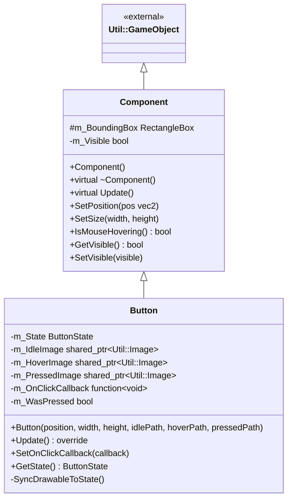
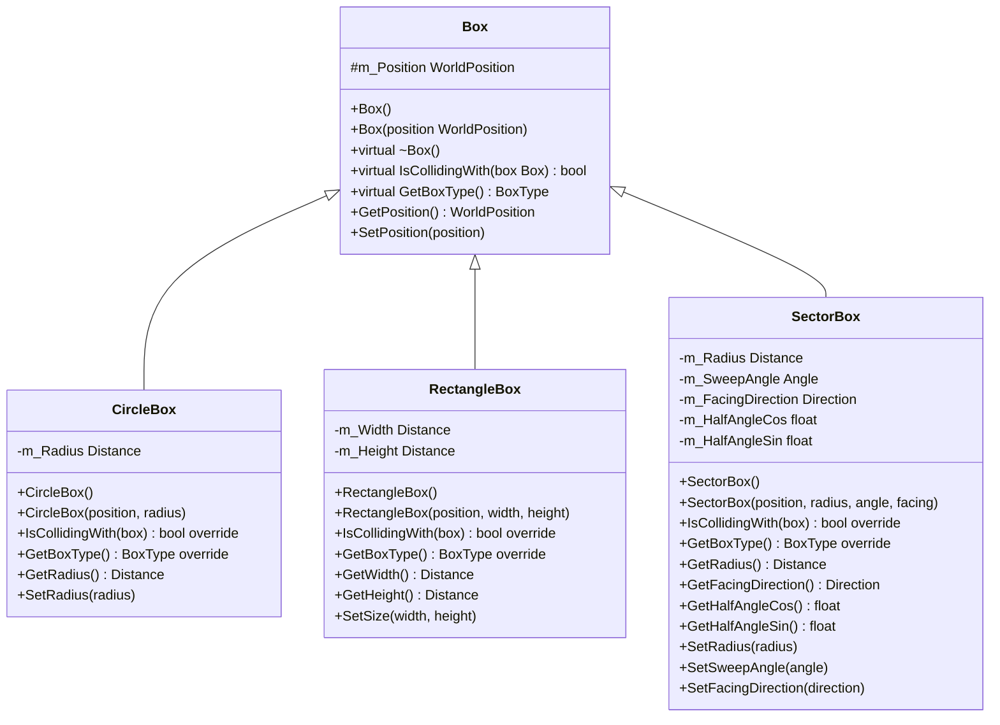
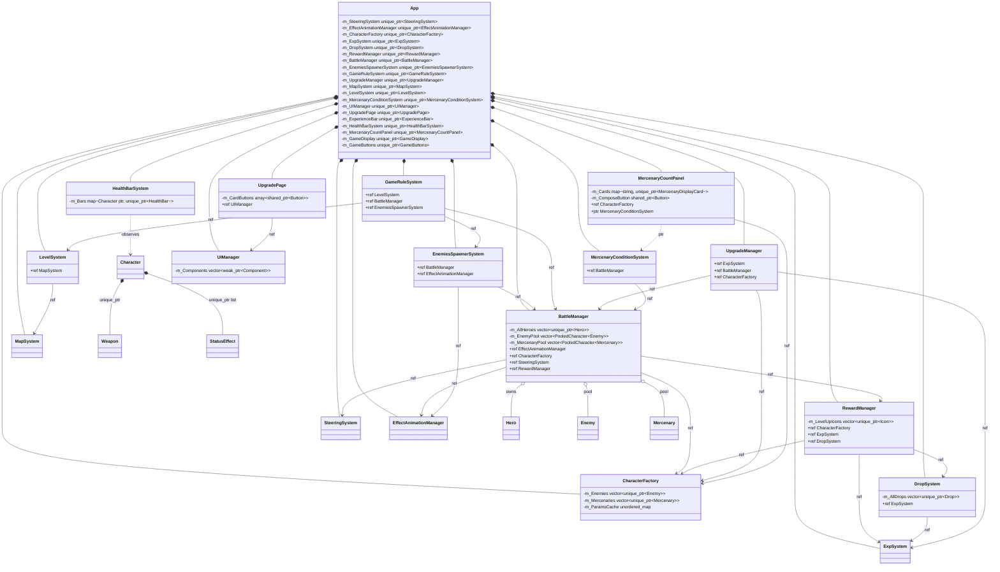

# UGO 遊戲專案架構 (PTSD-Template)

## 1. 繼承關係圖

```mermaid
classDiagram
    direction TB

    class BasicObject {
        +BasicObject()
        +BasicObject(BasicObjectParams params)
        +BasicObject(SpeedValue speed)
        +virtual ~BasicObject()
        +Reset(BasicObjectParams params)
        +GetWorldPosition() WorldPosition
        +GetSpeed() SpeedValue
        +IsDead() bool
        +GetGameObject() shared_ptr~Util::GameObject~
        +GetAnimation() shared_ptr~Util::Animation~
        +GetSize() vec2
        +GetHitBox() Box*
        +GetHurtBox() Box*
        +SetWorldPosition(pos)
        +SetImage(image)
        +SetImage(imagePath)
        +SetAnimation(animation)
        +SetAnimation(paths, play, interval, looping, cooldown)
        +SetAnimationState(play)
        +SetSpeed(speed)
        +SetDrawableType(type)
        +SetSize(width, height)
        +SetScale(scale)
        +SetRotation(rotation)
        +SetFlip(flipX, flipY)
        +SetHitBox(hitBox)
        +SetHurtBox(hurtBox)
        +ActivateHitBox(active)
        +ActivateHurtBox(active)
        +ActivateCollidable(active)
        +SetIsGridWalkableCallback(callback)
        +virtual Update()
        +virtual OnDraw()
        +virtual OnAttack()
        +virtual OnDamage(amount)
        +virtual OnHeal(amount)
        +virtual OnDeath()
        +TryMove(intendedOffset, externalOffset)
        #OffsetCalculator(offset, considerWall) WorldPosition
        #SetDead(dead)
        #GetFlipX() bool
        #GetFlipY() bool
        -m_GameObject shared_ptr~Util::GameObject~
        -m_Animation shared_ptr~Util::Animation~
        -m_Image shared_ptr~Util::Image~
        -m_DrawableType DrawableType
        -m_Scale vec2
        -m_FlipX bool
        -m_FlipY bool
        -m_Speed SpeedValue
        -m_Position WorldPosition
        -m_Dead bool
        -m_HitBox unique_ptr~Box~
        -m_HurtBox unique_ptr~Box~
        -m_CollisionBox unique_ptr~RectangleBox~
        -m_IsHitBoxActive bool
        -m_IsHurtBoxActive bool
        -m_IsCollidable bool
    }

    class Character {
        +Character()
        +Character(CharacterParams params)
        +Character(maxHP, attackPower, speed)
        +virtual ~Character()
        +Reset(CharacterParams params)
        +GetMaxHP() HpValue
        +GetCurrentHP() HpValue
        +GetAttackPower() HpValue
        +GetTypeID() string
        +GetIntendedMovement() Velocity
        +GetRepelMovement() Velocity
        +GetAttackAnimationData() EffectAnimationData
        +GetDamageAnimationData() EffectAnimationData
        +SetIntendedMovement(v)
        +AddRepelMovement(v)
        +SetAttackAnimationData(data)
        +SetDamageAnimationData(data)
        +SetAttackCooldownDuration(duration)
        +SetInvincibleDuration(duration)
        +OnAttack() override
        +OnDamage(amount) override
        +OnHeal(amount) override
        +OnDeath() override
        +AddStatusEffect(data)
        +RemoveStatusEffectBySource(sourceID)
        +Update() override
        +OnDraw() override
        #SetMaxHP(newMaxHP)
        #TakeDamage(amount)
        #Heal(amount)
        #SetAttackPower(attackPower)
        #AcceptIntendedMovement()
        -m_MaxHP HpValue
        -m_CurrentHP HpValue
        -m_AttackPower HpValue
        -m_TypeID string
        -m_AttackCooldown CountDownTimer
        -m_InvincibleTimer CountDownTimer
        -m_Weapon unique_ptr~Weapon~
        -m_StatusEffects vector~unique_ptr~StatusEffect~~
        -m_IntentedMovement Velocity
        -m_RepelMovement Velocity
    }

    class Bot {
        +Bot(CharacterParams params)
        +Bot(maxHP, attackPower, speed)
        +~Bot()
        +Reset(CharacterParams params)
        +virtual AIUpdate(targets vector~Character*~)
        +Update() override
        +OnDraw() override
        +SetTarget(target Character*)
        +OnAttack() override
        +OnDamage(amount) override
        +OnHeal(amount) override
        +OnDeath() override
        -FindTarget(targets)
        -m_Target const Character*
        -m_TargetUpdateTimer Tick
        -m_TARGET_UPDATE_INTERVAL Tick
        -m_STOP_PURSUIT_DISTANCE Distance
    }

    class Hero {
        +Hero(CharacterParams params)
        +Hero(maxHP, attackPower, speed)
        +~Hero()
        +Reset(CharacterParams params)
        +KeyboardUpdate()
        +Update() override
        +OnDraw() override
        +OnAttack() override
        +OnDamage(amount) override
        +OnHeal(amount) override
        +OnDeath() override
        +GainExp(amount)
        +virtual OnLevelUp()
        +GetLevel() LevelValue
        +GetCurrentExp() ExpValue
        +GetMaxExp() ExpValue
        -UpdateMaxExp()
        -m_Level LevelValue
        -m_CurrentExp ExpValue
        -m_MaxExp ExpValue
    }

    class Enemy {
        +Enemy(CharacterParams params)
        +Enemy(maxHP, attackPower, speed)
        +~Enemy()
        +Reset(CharacterParams params)
        +AIUpdate(targets) override
        +Update() override
        +OnDraw() override
        +OnAttack() override
        +OnDamage(amount) override
        +OnHeal(amount) override
        +OnDeath() override
        +GetExpReward() ExpValue
        +GetDropRate() float
        +GetExpPackValue() ExpValue
        -m_ExpReward ExpValue
        -m_DropRate float
        -m_ExpPackValue ExpValue
    }

    class Mercenary {
        +Mercenary(CharacterParams params)
        +Mercenary(maxHP, attackPower, speed)
        +~Mercenary()
        +Reset(CharacterParams params)
        +AIUpdate(targets) override
        +Update() override
        +OnDraw() override
        +OnAttack() override
        +OnDamage(amount) override
        +OnHeal(amount) override
        +OnDeath() override
        +IsTrulyDead() bool
        +SetTrulyDead()
        +IsRespawning() bool
        +CanRespawn() bool
        +StartRespawnCooldown()
        +Respawn(spawnPosition)
        -m_State MercenaryState
        -m_RespawnTimer CountDownTimer
    }

    class Drop {
        +Drop()
        +virtual ~Drop()
        +Update() override
        +OnDraw() override
        +virtual OnPickup(hero Hero*)
        +MoveTo(target WorldPosition)
        +GetState() State
        #m_State State
        #m_TargetPosition WorldPosition
    }

    class ExpPack {
        +ExpPack(expValue)
        +~ExpPack()
        +Update() override
        +OnDraw() override
        +OnPickup(hero Hero*) override
        +GetExpValue() ExpValue
        -m_ExpValue ExpValue
    }

    class Icon {
        +Icon()
        +~Icon()
        +Update() override
        +OnDraw() override
    }

    class Interactable {
        +Interactable()
        +virtual ~Interactable()
        +Update() override
        +OnDraw() override
        +OnInteract()
        -m_interactRange Distance
        -m_interactTimer CountDownTimer
    }

    class Projectile {
        +Projectile()
        +virtual ~Projectile()
        +GetDirection() WorldPosition
        +GetSpeed() SpeedValue
        +GetDamage() HpValue
        +virtual Update()
        +virtual OnDraw()
        -m_direction WorldPosition
        -m_damage HpValue
        -m_lifetime TimeStep
        -m_owner unique_ptr~Character~
    }

    class DamageTextAnimation {
        +DamageTextAnimation()
        +~DamageTextAnimation()
        +Start(position, damageAmount)
        +End()
        +IsOccupied() bool
        +Update() bool
        -m_Text shared_ptr~Util::Text~
        -m_AnimationDuration CountDownTimer
        -m_IsOccupied bool
        -m_DamageAmount HpValue
    }

    class EffectAnimation {
        +EffectAnimation()
        +~EffectAnimation()
        +Start(position, duration, animation, isImage, rotateAngle, size)
        +End()
        +IsOccupied() bool
        +Update() bool
        -m_Animation shared_ptr~Util::Animation~
        -m_AnimationDuration CountDownTimer
        -m_IsOccupied bool
    }

    BasicObject <|-- Character
    BasicObject <|-- Drop
    BasicObject <|-- Interactable
    BasicObject <|-- Projectile

    Character <|-- Hero
    Character <|-- Bot

    Bot <|-- Enemy
    Bot <|-- Mercenary

    Drop <|-- ExpPack
    Drop <|-- Icon
```

---

## 2. UI 繼承關係圖

---

## 3. Core 碰撞盒繼承關係

---

## 4. System / Manager 類別說明

| 類別 | 說明 |
|---|---|
| `BattleManager` | 統一管理 Hero/Enemy/Mercenary 的生命週期、AI 更新、移動更新、攻擊碰撞偵測與解算 |
| `CharacterFactory` | 從 JSON 解析角色參數並快取，透過物件池建立 Enemy/Mercenary，直接建立 Hero |
| `SteeringSystem` | 計算角色間的排斥向量（防重疊群聚系統） |
| `EffectAnimationManager` | 管理特效動畫（攻擊/受傷）與傷害數字的物件池 |
| `DropSystem` | 管理掉落物的生命週期、磁吸與拾取邏輯 |
| `ExpSystem` | 派發 EXP 給 Hero 並廣播升級事件給監聽器 |
| `RewardManager` | 監聽敵人死亡事件，觸發 EXP 掉落與升級圖示 |
| `EnemiesSpawnerSystem` | 根據房間配置分波生成敵人，管理生成計時器與位置 |
| `MapSystem` | 解析房間 JSON，動態載入/卸載地圖磁磚 BasicObject |
| `LevelSystem` | 管理整體關卡佈局（房間圖）、Portal 觸發盒、難度遞增 |
| `GameRuleSystem` | 每幀檢查勝負條件（Hero 死亡 / 關卡完成 / 敵人超限） |
| `UpgradeManager` | 抽卡卡池管理、升級效果派發，透過 callback 與 App 溝通 |
| `MercenaryConditionSystem` | 傭兵合成配方 & 羈絆系統的條件判定引擎 |
| `UIManager` | 統一調度所有 UI::Component 的每幀更新，以 weak_ptr 持有組件 |
| `HealthBarSystem` | 同步管理場上所有角色的血條（建立/移除/位置更新） |

---

## 5. 物件引用關係圖

